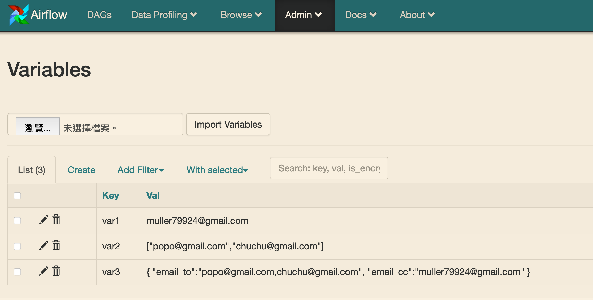

Description
------------
In this section, I am going to demonstrate how to set/get **Variables**.

This section will cover things below
- Variables
- Jinja template


Situation
------------
My friend Popo said she also wants to get the alert email.
And the next day, my friend Chuchu ask ...

```python
t_send_email = EmailOperator(
            ...
            to="me@mail",
            ...)

# add recipients
t_send_email = EmailOperator(
            ...
            to=["me@mail","popo@mail","chuchu@mail"],
            ...)
```

It may be difficult to maintain the recipients list, if you just hard code it.


Variables
------------
>   Variables are a generic way to store and retrieve arbitrary content or settings as a simple key value store within Airflow. Variables can be listed, created, updated and deleted from the UI (Admin -> Variables), code or CLI.

In general, I will set variables from web UI, and read it from code.

###### Set from Web UI




###### Read from Python Code

Now we can rewrite the code with **variable** feature.
<br>
There are two ways:

```python
# First: use airflow.models.variable.Variable
from airflow.models import Variable

my_email_addr = Variable.get("var1")

t_send_email = EmailOperator(
            task_id='send_email',
            subject="Today's S&P 500 value",
            to=my_email_addr,
            html_content="Hey, it is higher than 3000",
            dag=dag)
```

What I prefer:
```python
# Second: use jinja template
t_send_email = EmailOperator(
            task_id='send_email',
            subject="Today's S&P 500 value",
            to=" {{ var.value.var1 }} ",
            html_content="Hey, it is higher than 3000",
            dag=dag)

```

If there are many variables being used in a dag, I will use json format to store it, like var3.

```python
t_send_email = EmailOperator(
            task_id='send_email',
            subject="Today's S&P 500 value",
            to=" {{ var.json.var3.email_to }} ",
            cc=" {{ var.json.var3.email_cc }} ",
            html_content="Hey, it is higher than 3000",
            dag=dag)
```


Notice
------------
In this section, I just briefly introduce this feature, and there are still many details need to know.

If you are curious about the syntax how to retrieve **Variables** in jinja template, I recommend you read the [official document](https://airflow.apache.org/concepts.html#variables). (Although I will cover it few sections later)

Try to use var2 or var4, if you want to dig into it. You may find something weird.


And you can read jinja document, try to figure out what is the meaning of this?
```python
" {{ var.value.var4 | int }} "
```

What's Next
------------
Right now, I and my friends can get an email when the value > 3000. But one day Popo asked for another feature, she said the email content is useless and wanted to know the exact value.

In the next section, I will introduce feature **XCom** and show you how to use it to fulfill popo's request.
