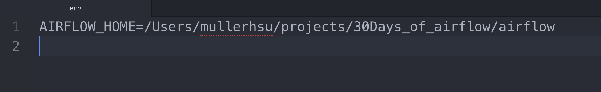
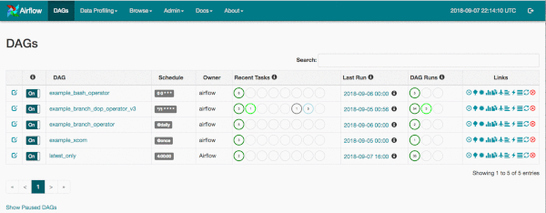

Basic Setting
------------
**Airflow needs home :**
> If you don't set it, "~/airflow" is the default

What I prefer: use `.env` to set environment variables

    $ touch .env
    Add "AIRFLOW_HOME=where_you_want/airflow" to .env

or

    $ export AIRFLOW_HOME=where_you_want/airflow

Installation
------------
What I prefer: use pipenv to control python version and create virtual environment

    $ pipenv shell --python 3.6
    // pipenv will load .env automatically
    // you would see "Loading .env environment variables…", if you take .env as your previous step
    $ pipenv install apache-airflow
or

    $ pip install apache-airflow

Hello World
------------
Initialize the database (sqlite)

    $ airflow initdb

Start the web server, default port is 8080

    $ airflow webserver

> visit localhost:8080 in the browser, and play around with the UI

