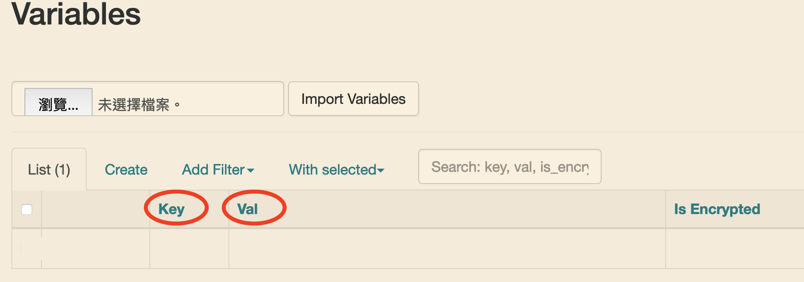
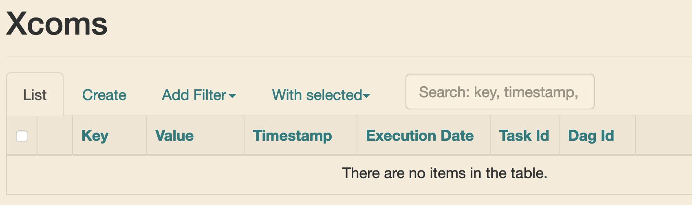

Description
------------
In this section, I am going to compare **Variable** to **XCom**, and explain when to use them properly.

This section will cover things below
- Variable
- XCom


Variable
------------
> Variables are a generic way to store and retrieve arbitrary content or settings as a simple key value store within Airflow.<br><br>
Variables can be listed, created, updated and deleted from the UI (Admin -> Variables), code or CLI.<br><br>
It can be useful to have some variables or configuration items accessible and modifiable through the web UI.

Use case: global/static setting

- key-value pair
- value is always stored as **String** type




In general, I use **Variable** to store values like
- email recipients
- files/resources path
- threshold value

### Syntax

#### Set
```python
# 1 Code
from airflow.models import Variable

Variable.set(key, value)
```

```bash
# 2 Command line
$ airflow variables --set key value
```

```bash
# 3 Web UI
refer to the previous section
```


#### Get
```python
# 1 Code
from airflow.models import Variable

## retrieve value with key "foo"
foo = Variable.get("foo")
## retrieve json content
bar = Variable.get("bar", deserialize_json=True)
## will get default if the variable isn’t defined
baz = Variable.get("baz", default_var=default)


# 2 Jinja template
{{ var.value.<variable_name> }}
{{ var.json.<variable_name> }}
```

XCom
------------
>It is an abbreviation of “cross-communication”, let tasks exchange messages.<br><br>
XComs are principally defined by a key, value, and timestamp, but also track attributes like the task/DAG that created the XCom.<br><br>
XComs are similar to Variables, but are specifically designed for inter-task communication rather than global settings.

Use case: inter-task communication

- defined by key, value, and timestamp
- could be string, int, float... depend on the value you set/return




### Syntax

#### Set
```python
# 1
## Operators with return value
def push_by_returning():
    """
    Pushes an XCom by returning it
    """
    return value

# 2
def push(**kwargs):
    """
    Pushes an XCom
    """
    kwargs['ti'].xcom_push(key=key, value=value)

t_push = PythonOperator(
    provide_context=True, # set it True to make airflow pass kwargs to your python function
    python_callable=push,
    ...
)
```

#### Get
```python
# 1 Code
def puller(**kwargs):
    ti = kwargs['ti']
    # get value with default key 'return_value'
    value1 = ti.xcom_pull(task_ids='task_id')
    # get value with specific key
    value2 = ti.xcom_pull(key=key, task_ids='task_id')

# 2 Jinja template
{{ ti.xcom_pull(task_ids='task_id') }}
{{ ti.xcom_pull(key=key, task_ids='task_id') }}

```

>In general, if two operators need to share information, like a filename or small amount of data, you should consider combining them into a single operator.

If it absolutely can’t be avoided, I will use **XCom** to store values.


What's Next
------------
Congrats! It is day 10, you already finished 1/3.

In the next few sections, I will introduce BashOperator, SSHOperator and hook.
