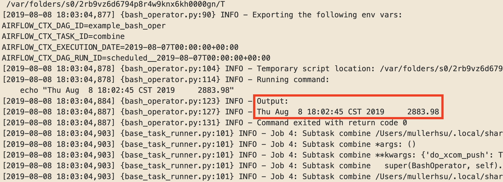

Description
------------
In this section, I am going to demonstrate how to use feature **XCom**.

This section will cover things below
- BashOperator
- Jinja template


BashOperator
------------
>  Execute a Bash script, command or set of commands.

Simple example

```python
t1 = BashOperator(
    task_id='task_name',
    bash_command='command',
    dag=dag,
)
```

I think BashOperator is quite straightforward so you can read examples from official [tutorial](https://github.com/apache/airflow/blob/master/airflow/example_dags/tutorial.py) and [example](https://github.com/apache/airflow/blob/master/airflow/example_dags/example_bash_operator.py).


And in the `bash_oper.py`, I use **curl** to scrape the data as the previous section.

```python
t_scrape_data = BashOperator(
    task_id='scrape_data',
    bash_command=("""
        curl -s "https://www.nasdaq.com/" \
                | grep 'storeIndexInfo(\"S&P 500\"' \
                | awk -F'","' '{print $2}'
    """),
    xcom_push=True, # do a xcom push
    dag=dag,
)
```

Result
------------
If you trigger this dag, you should get something like "date value"




What's Next
------------
BashOperator execute commands locally. What if you want to run scripts on a remote server?

There are two ways
1. BashOperator
2. SSHOperator

In the next section, I will introduce how to use SSHOperator.
(But it could be hard to do a practice, if you don't have a remote server)
