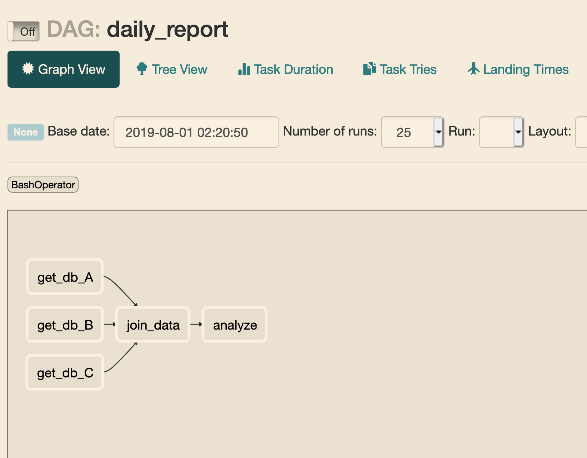

Tutorial
------------
> Please read this with tutorial.py

For examples, we want to export a report daily.
<br>
There are steps to do:
- task_1_a : extract data from db_A
- task_1_b : extract data from db_B
- task_1_c : extract data from db_C
- task_2 : join dataset from A,B,C and transform them to the format you want
- task_3 : analyze data

We need to make sure that task_2 is only executed when task_1_(a,b,c) are finished (all the dataset are ready).
Otherwise there may be some missing rows/columns in the join-dataset.
So we need to set dependencies and define workflow.

Define workflow
------------
In Airflow, workflow is called "DAG" – or a Directed Acyclic Graph.
<br>
DAG is a collection of tasks with their relationships and dependencies.


Define dag
------------
Define the "daily report" workflow, triggered everyday
```python
dag = DAG('daily_report', # dag name
          default_args=default_args,  # args passed in as default, we will dive into them later
          schedule_interval=timedelta(days=1) # frequency that dag will be executed
          )
```
Airflow also supports **cron expression**
<br>
The above dag is equivant to below
```python
dag = DAG(..., schedule_interval='0 0 * * *')
or
dag = DAG(..., schedule_interval="@daily")
```


Define tasks
------------
There are many kinds of **operators** that you can use in the dag.
Right now I simply use BashOperator as an example
```python
t2 = BashOperator(
        task_id='join_data',
        bash_command='sh join_data.sh',
        dag=dag)
```

Define dependency
------------
I think it is quite straightforward
```python
t1 >> t2
# t2 will be executed when t1 is finished
```

Notice
------------
This example counld not be executed in fact, just simply a demonstration

If you see how the dag looks in airflow, you can copy `tutorial.py` to the `dags` folder which we created at day2
<br>
If you set all things properly, you may see the same as mine



Summary
------------
Workflow is dag.
<br>
Tasks are what you are going to do in the workflow.
<br>
Task is defined by operator (like BashOperator)
<br>
Tasks need to be executed in a specific order so you need to set dependencies.
