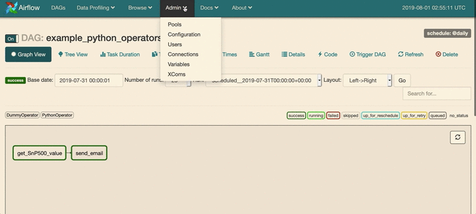
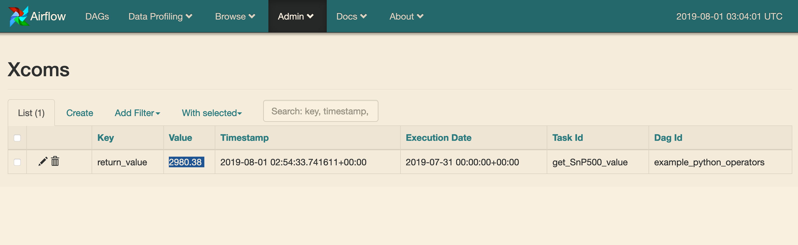

Python Operator
------------
In this section, I want to design a pipeline to get S&P 500 value and send an email as an alert to myself.

This section will cover operators below
- DummyOperator
- PythonOperator


Dummy Operator
------------
>  It literally does nothing.
<br>
Gernally, I use it to represent an unimplemented feature

Sending email could be done by EmailOperator
<br>
As it is not mentioned yet, I use dummy operator to represent this feature.
```python
t_send_email = DummyOperator(
    task_id='send_email',
    dag=dag,
)
```

Python Operator
------------
> Executes a Python callable

Simple example below

```python
def python_func():
  #do something
  pass
  # if you return a value, other tasks can use it through xcom

t_python_oper = PythonOperator(
                    task_id="task_name",
                    python_callable=python_func,
                    dag=dag)
```

In this tutorail, I write a python function to get S&P 500 value at the site nasdaq.
<br>
Don't be panic if you are not familiar with requests or regex. It is just an example for python operator.

```python
PATTERN = 'storeIndexInfo\("S&P 500","(.+?)"'
extractor = re.compile(PATTERN)

def get_SnP500():
    """
    use requests library to scrape site nasdaq
    to get S&P 500 value
    """
    res = requests.get("https://www.nasdaq.com/")
    value = extractor.findall(res.text)[0]
    return value

t_get_SnP500 = PythonOperator(
                    task_id="get_SnP500_value",
                    python_callable=get_SnP500,
                    dag=dag)
```


Notice
------------

Remember to install **requests**, if you don't have it.

What I prefer:

    $ pipenv install requests

Or you can install it directly

    $ pip install requests

How to run it
------------
1. Remember to copy the `py_oper.py` to the `dags` folder
2. Start the airflow web UI server to help you monitor the tasks

        $ airflow webserver

3. Through the web UI, click the switch (next to the dag name) from off to on
4. Start the scheduler to execute tasks

        $ airflow scheduler

And then you should see things like gifs below
<br>


*
It will be a bit different, you may have a long list of dags.

Until the color of task "get_SnP500" turn into dark green green, which means it is finished.


You can click the **Admin** -> **Xcoms**


You should see the S&P500 value you scrape from the site nasdaq, may be different from mine



What is Next
------------
Right now we will get email (not implement actully) with S&P500 value everyday.
<br>
But what if I only want to get the email when the value is higher than 3000.
<br>
How could it be done?
<br>
We can still implement it with PythonOperator, but there is another feature called **Branch** and I will introduce it in the next section.
