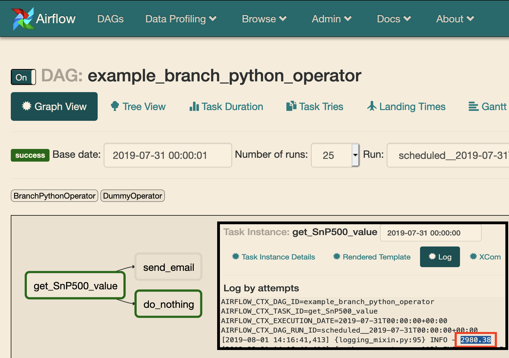

Description
------------
In this section, I only want to get mail when S&P 500 value is higher 3000.

This section will cover operators below
- PythonOperator
- BranchPythonOperator


Python Operator
------------
Start from what we are familiar with - PythonOperator
<br>
As a workaround, I can write code like this

```python
PATTERN = 'storeIndexInfo\("S&P 500","(.+?)"'
extractor = re.compile(PATTERN)

def get_SnP500():
    """
    use requests library to scrapy site nasdaq
    to get S&P 500 value
    """
    res = requests.get("https://www.nasdaq.com/")
    value = extractor.findall(res.text)[0]
    if value > 3000:
      return value
    else:
      raise Exception("value is too low")

t_get_SnP500 = PythonOperator(
                    task_id="get_SnP500_value",
                    python_callable=get_SnP500,
                    dag=dag)
```

What happened when we raise exception in airflow?
<br>
It will be marked as **up_for_retry** and try again few minutes later. (which is configurable)
If the task reach the maximum retry-time, then task will be marked as **failed**. And the whole dag will stop at this step.


Branch Python Operator
------------
>   Allows to execute different downstream task, when different situation happened.

Simple example

```python
def branch_func():
    if 'situation':
        return 'task_A'
    else:
        return 'task_B'

t_branch_oper = BranchPythonOperator(
    task_id='task_name',
    python_callable=branch_func,
    dag=dag,
)
```

Then we can rewrite the PythonOperator with BranchPythonOperator

```python
PATTERN = 'storeIndexInfo\("S&P 500","(.+?)"'
extractor = re.compile(PATTERN)

def if_value_higher_3000():
    """
    This function shows
    1. get value from website
    2. if value > 3000, we send email as an alert, otherwise we do nothing

    python branch operator should return "task name" as a choice
    """
    res = requests.get("https://www.nasdaq.com/")
    SnP500_value = extractor.findall(res.text)[0]
    if float(SnP500_value) > 3000:
        return 'send_email'
    else:
        return 'do_nothing'

t_get_SnP500 = BranchPythonOperator(
    task_id='get_SnP500_value',
    python_callable=if_value_higher_3000,
    dag=dag,
)
```

Result
------------
Your result may be different from mine, which depends on the value you get.
<br>
I got 2980.38, lower than 3000, so do nothing


