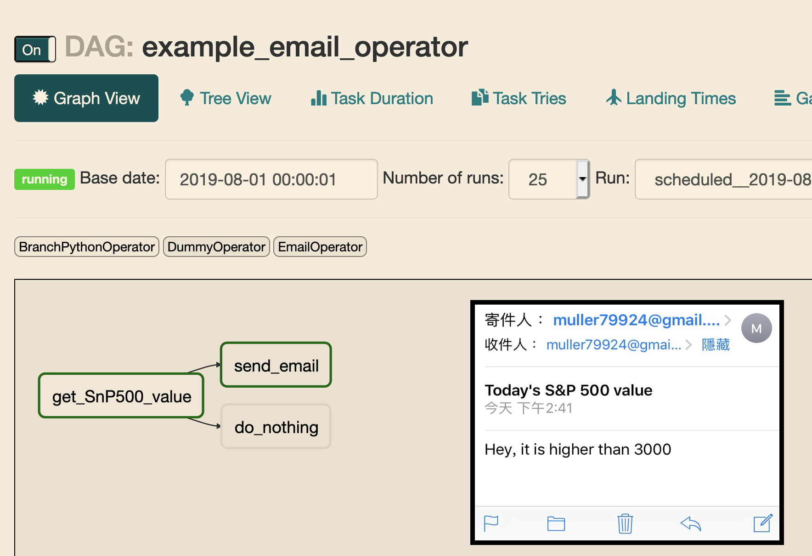

Description
------------
In this section, I am going to implement the email feature with EmailOperator.

This section will cover things below
- EmailOperator
- airflow config


Email Operator
------------
>   Sends an email.

Simple example

```python
t_email = EmailOperator(
            task_id='task_name',
            subject="email title",
            to="airflow@example.com",
            html_content="Hope you find this tutorial is useful :)",
            dag=dag)
```

And I want to send an email to myself as an alert when value > 3000

```python
t_send_email = EmailOperator(
            task_id='send_email',
            subject="Today's S&P 500 value",
            to="receiver@gmail.com",
            # please replace it with your own email address
            html_content="Hey, it is higher than 3000",
            dag=dag)
```

You may have some questions after reading the code above.
<br>
Where can I set the "sender" argument?
<br>
Where can I enter my email password?

> We need to set these in `airflow.cfg`.

If you are familiar with smtp service, you can skip the next part and use whatever you prefer, otherwise I choose google as an example.

Google SMTP Setting (Optional)
------------
You can choose whichever smtp service provider you want, like Amazon, Microsoft, Mailgun ...
<br>
I choose Google as an example, because Gmail is the most popular one.
<br>
Before we can use google's smtp service, we need to create an application password:
[Create & use App Passwords](https://support.google.com/accounts/answer/185833)
<br>
If you create it suceeuflly, you should get a 16-character code as your application password.

Airflow Config
------------
Remember we ran command "airflow initdb" at day2, and it generated files automatically, including default config `airflow.cfg`.
<br>
If we want to make EmailOperator work, we need to modify arguments in the `airflow.cfg`.

*If you miss your 16_CHAR_APP_PASSWORD, just create a new one.

    [smtp]
    # the airflow.utils.email.send_email_smtp function, you have to configure an
    # smtp server here
    smtp_host = smtp.gmail.com
    smtp_starttls = True
    smtp_ssl = False
    smtp_user = your@gmail.com
    smtp_password = 16_CHAR_APP_PASSWORD
    smtp_port = 587
    smtp_mail_from = your@gmail.com


Result
------------
After these hard work and setting, you can trigger your dag, and should get the result as mine.




What's Next
------------
Right now, we will get an email when the value > 3000.
<br>
What if my colleagues/friends also want to get the alert email.
It may not be a good way to hard code the list of recipients. (you may change it frequently)
<br>
In the next section, I will introduce feature **Variable** and how to use it.
