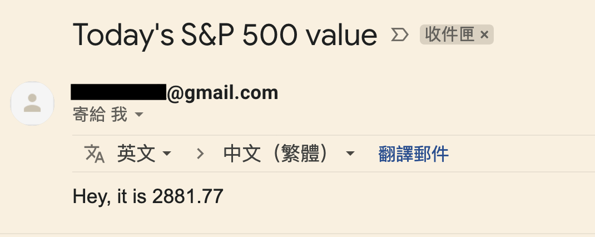

Description
------------
In this section, I am going to demonstrate how to use feature **XCom**.

This section will cover things below
- XCom
- Jinja template


Situation
------------
To fulfill popo's request, we need to figure out a way to put the S&P 500 value in the email content.
<br>


And you may think the code below could work

```python
# part from xcom_ex0.py
res = requests.get("https://www.nasdaq.com/")
SnP500_value = extractor.findall(res.text)[0]

t_send_email = EmailOperator(
            task_id='send_email',
            subject="Today's S&P 500 value",
            to=" {{ var.json.var3.email_to }} ",
            html_content=f"Hey, it is {SnP500_value}, higher than 3000",
            dag=dag)
```
But it didn't.

Airflow is designed as distributed orchestration framework, so tasks may be executed in different computers, which means task_A can't use task_B's values directly.

How do we share values between tasks?

Here comes a value exchange mechanism called **XCom**.

XCom
------------
>   XComs are similar to Variables, but are specifically designed for internal tasks' communication rather than global settings.

If you read this tutorial carefully, you will find out I have already mentioned **XCom** in day5 - PythonOperator.

By default, PythonOperator will store the return value as xcom.
```python
def python_func():
  #do something
  pass
  # if you return a value, other tasks can use it through xcom

t_python_oper = PythonOperator(
                    task_id="task_name",
                    python_callable=python_func,
                    dag=dag)
```


<br>

Below I demonstrate two ways to fulfill popo's request.


#### First
> Read this with xcom_ex1.py

 I build pipeline in this order:

        Python(scrape) >> Branch(>3000?) >> [Email, Dummy]

So here I get S&P 500 value and return it.

Airflow will automatically store the value for me. (Technical term: do a xcom push)

```python
def get_SnP500():
    """
    use requests library to scrapy site nasdaq
    to get S&P 500 value
    """
    res = requests.get("https://www.nasdaq.com/")
    value = extractor.findall(res.text)[0]
    return float(value)
```

And I can retrieve it in another task. (Technical term: do a xcom pull)

```python
def if_value_higher_3000(**kwargs):
    SnP500_value = kwargs['ti'].xcom_pull(task_ids='get_SnP500_value')
    ....
```

#### Second
> Read this with xcom_ex2.py

I build pipeline in this order:

        Branch(scrape & >3000?) >> [Email, Dummy]


Do a xcom push in the BranchPythonOperator
```python
def get_value_see_if_value_higher_3000(**kwargs):
    res = requests.get("https://www.nasdaq.com/")
    value = extractor.findall(res.text)[0]
    SnP500_value = float(value)
    kwargs['ti'].xcom_push(key='SnP',value=SnP500_value)
    ...
```

Then do a xcom pull with jinja template.

```python
t_send_email = EmailOperator(
            ...,
            html_content="""
                Hey, it is {{ ti.xcom_pull(key='SnP', task_ids='higher_3000') }}
            """,
            dag=dag)
```

#### Third
In fact, web scraping, branching(if/else), sending email can be done in only one PythonOperator.

But I am not going to show you how to do this, I think you can figure it out.


Result
------------
If you set things properly, you can receive email like mine.



*The value is not higher than 3000, because I set the if/else statement to True. You can change the threshold to get different result.

What's Next
------------
Right now, we can get an alter email with exact value when S&P 500 value > 3000.

In the next section, I will dive into **Variable** and **XCom** and show the difference between them.
